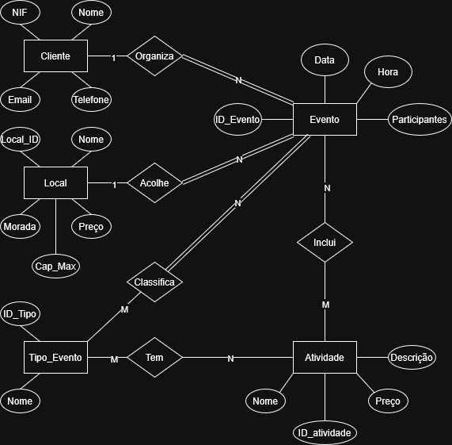

# BD: Trabalho Prático APFE

**Grupo**: P7G1
- José Silva, MEC: 103248
- Joana Silva, MEC: 119844

## Introdução / Introduction
 
Este trabalho prático tem como objetivo a criação e desenvolvimento de um sistema de bases de dados relacional para suportar uma plataforma centralizada de gestão de eventos. A solução proposta tem como objetivo modelar e simplificar todo o processo de planeamento de diversos eventos, permitindo a gestão de clientes, a alocação de locais físicos para a realização dos eventos e a contratação personalizada de atividades extra associadas (como catering, animação ou fotografia). O desenvolvimento, sendo feito em Microsoft SQL Server, foca-se na criação de um modelo de dados sólido que assegure a gestão eficiente de reservas, prevenindo conflitos de datas, pessoas e facilitando o controlo de todos os serviços contratados.

## ​Análise de Requisitos / Requirements

1. Requisitos Funcionais

    RF01 - Gestão de Clientes: O sistema deve permitir registar, consultar, atualizar e remover dados de clientes (nome, contactos, NIF).

    RF02 - Gestão de Tipos de Evento: O sistema deve ter um catálogo de tipos de eventos possíveis (ex: Casamento, Batizado, Festa de Aniversário, Funeral, Conferência Corporativa).

    RF02 - Gestão de Locais: O sistema deve manter um catálogo dos espaços disponíveis para aluguer, incluindo a sua morada, capacidade máxima de pessoas e o custo base de aluguer.

    RF04 - Gestão de Atividades Extra: O sistema deve permitir gerir os serviços complementares (ex: catering, música, decoração, fotografia), definindo o seu custo e descrição.

    RF05 - Marcação de Eventos: O sistema deve permitir a criação de um evento, associando-o a um cliente, a um local e definindo a data, hora e o número de convidados previstos.

    RF06 - Associação de Atividades a Eventos: O sistema deve permitir adicionar ou remover múltiplas atividades extra a um evento já agendado.

    RF07 - Cálculo de Custos (Faturação base): O sistema deve ser capaz de calcular e apresentar o valor total do evento, somando o custo de aluguer do local com o custo das atividades extra contratadas.
    
    RF08 - Associação de Atividades a Tipos de Evento: O sistema deve permitir definir que atividades extra estão disponíveis para cada tipo de evento.

2. Requisitos Não Funcionais

    RNF01 - Sistema Gestor de Base de Dados: O armazenamento e a gestão dos dados serão realizados exclusivamente no Microsoft SQL Server.

    RNF02 - Interface Gráfica: A camada de apresentação será desenvolvida em C# utilizando a tecnologia Windows Forms (Visual Studio).

    RNF03 - Comunicação de Dados: A interação entre a interface e a base de dados será feita obrigatoriamente e exclusivamente em linguagem SQL nativa.

3. Regras de Negócio (Business Rules)

    RN01 - Prevenção de Overbooking: Um mesmo local não pode ter dois eventos agendados para a mesma data e bloco de horas.

    RN02 - Limite de Lotação: O número de convidados de um evento não pode ultrapassar a capacidade máxima definida para o local escolhido.

    RN03 - Integridade de Datas: Não é possível agendar eventos para datas passadas no momento da marcação.

    RN04 - Exclusividade de Atividades: Num mesmo evento, a mesma atividade extra não pode ser adicionada em duplicado.

    RN05 - Restrição de Atividades por Tipo de Evento: Apenas é permitido adicionar a um evento atividades extra que estejam previamente aprovadas/associadas ao tipo desse mesmo evento.

## DER

## ER

